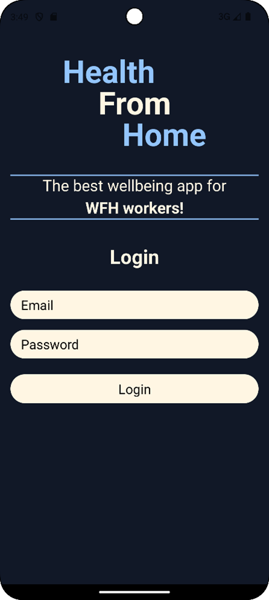
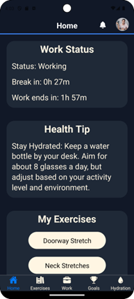
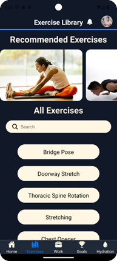
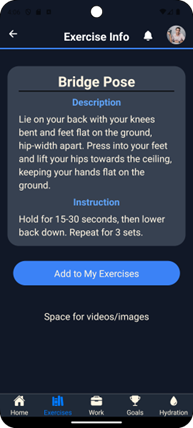
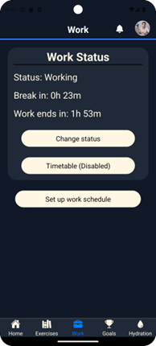
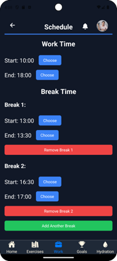
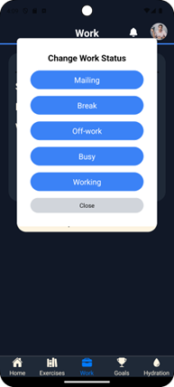
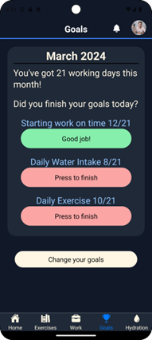
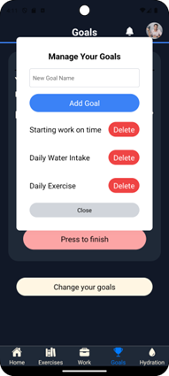
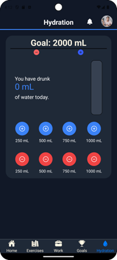

# Health From Home App

Welcome to **Health From Home**, a comprehensive wellness app designed specifically for remote workers. This app aims to enhance your well-being through a variety of features focused on health and productivity. The app is a solo project, fully created by me.

## Features

### Login and Authentication

- **Secure Login**: Users must log in with an email and password to access the app. Firebase handles authentication to ensure your data is safe.

### Home Page

- **Dashboard**: View your work status, next break time, and a random health tip.
- **Navigation Bar**: Easily access different sections of the app.
- **My Exercises**: Quickly view and access exercises you’ve added to your list.

### Exercise Library
 
- **Comprehensive List**: Browse through a variety of exercises fetched from the Firebase database.
- **Search Functionality**: Easily find exercises by name.
- **Exercise Info**: Detailed description and instructions for each exercise.
- **Favorites**: Add or remove exercises from your personal list.

### Work Page
  
- **Work Status**: Monitor and change your current work status.
- **Break Timer**: Keep track of your next break and work end time.
- **Work Schedule**: Set up your work schedule, including start and end times, and break times.

### Goals Page
 
- **Personal Goals**: Track and manage your daily goals, such as water intake or exercise routines.
- **Real-Time Updates**: Goals are updated in real-time and stored in the Firebase database.

### Hydration Page

- **Water Intake Tracker**: Visualize your daily water consumption and adjust your drinking goals.
- **Interactive Buttons**: Easily add or remove water intake with interactive buttons.

## Implementation Details

### Technologies Used
- **React Native**: The app is built using React Native, leveraging JavaScript for cross-platform mobile development.
- **Expo Go**: Chosen for its convenience in testing and visualization on both physical devices and emulators.
- **Firebase**: Utilized for backend services, including database management, authentication, and real-time notifications.

### Program Structure
- **Components**: Reusable building blocks of the app.
- **Context**: Manages state and data flow through the component tree.
- **Navigations**: Handles screen transitions within the app.
- **Screens**: Main views for user interaction, representing different aspects of the wellness experience.

### Firebase Integration
- **Firestore Database**: Stores all app data, ensuring scalability and flexibility.
- **Authentication**: Secure login system using email and password.
- **Real-Time Data**: Instant updates for user-specific data like goals and exercises.

## Conclusion

**Health From Home** is designed to support remote workers in maintaining a healthy work-life balance. With features tailored to promote wellness and productivity, this app is your companion in achieving a healthier, more organized remote working experience.

Feel free to explore the app and make the most of its features to improve your daily routine. Your wellness journey starts here!
